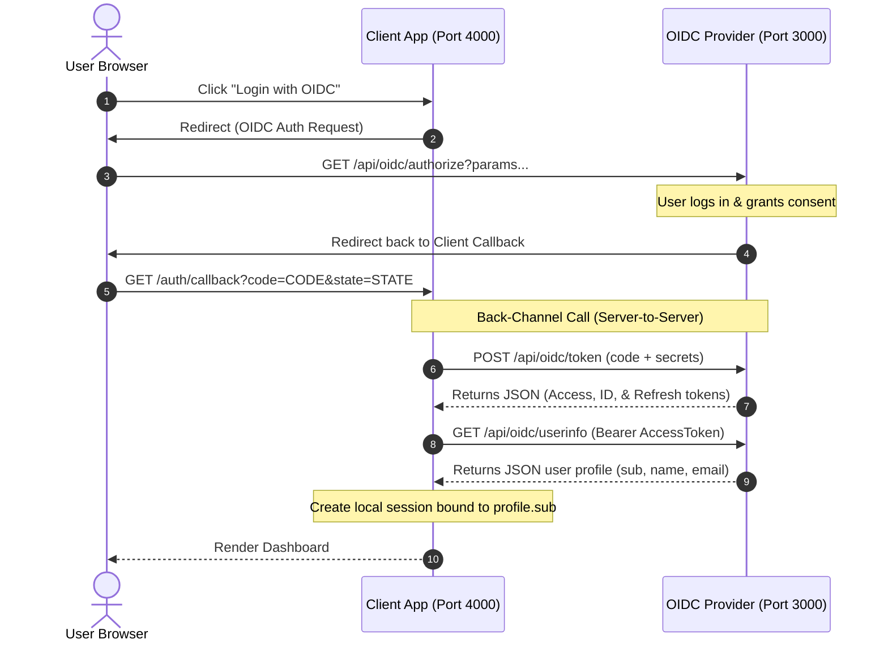

# OpenID Connect (OIDC) — Client Integration Guide

This guide explains how to integrate a client application (such as the Todo App) with the custom OIDC Identity Provider using the standard **OAuth 2.0 Authorization Code Flow**.

---

## 🗺️ Flow Overview

The OIDC integration is completed in **5 key steps**:



---

## 🛠️ Step-by-Step Implementation Details

### Step 1 — Client Application Registration
Before interacting with the OIDC provider, the client application must be registered to obtain credentials.

* **Endpoint**: `POST http://localhost:3000/api/clients/register`
* **Content-Type**: `application/json`
* **Request Payload**:
```json
{
  "app_name": "Todo Application",
  "redirect_uri": "http://localhost:4000/auth/callback"
}
```

* **Server Response (201 Created)**:
```json
{
  "statusCode": 201,
  "data": {
    "id": "c8f85f8e-d901-4475-ae9e-df3114d64234",
    "client_id": "todo-client-id",
    "client_secret": "todo-client-secret",
    "app_name": "Todo Application",
    "redirect_uri": "http://localhost:4000/auth/callback",
    "created_at": "2026-05-31T10:00:00.000Z"
  },
  "message": "Client registered successfully"
}
```
> [!IMPORTANT]
> Save the `client_id` and plain text `client_secret` in the Client application's `.env` configuration file.

---

### Step 2 — Authorization Request (Redirect)
When the user clicks the "Login" button, the client app redirects the user's browser to the OIDC provider's authorization page.

* **Endpoint**: `GET http://localhost:3000/api/oidc/authorize`
* **Query Parameters**:
  - `client_id`: The client ID obtained in Step 1.
  - `redirect_uri`: The callback endpoint of the client app.
  - `response_type`: Must be `code`.
  - `scope`: Permissions requested (e.g., `openid profile email`).
  - `state`: A random CSRF prevention string.

* **Example Redirect URL**:
```text
http://localhost:3000/api/oidc/authorize?client_id=todo-client-id&redirect_uri=http%3A%2F%2Flocalhost%3A4000%2Fauth%2Fcallback&response_type=code&scope=openid+profile+email&state=todosessionstate999
```

* **Server Response (302 Redirect)**:
  - If the user is not logged in, the provider redirects the browser to the Sign In screen.
  - If the user is logged in but hasn't consented, the provider redirects the browser to the Consent screen.
  - Once authenticated and authorized, the provider redirects the browser back to the client's `redirect_uri` with an authorization code:
```http
HTTP/1.1 302 Found
Location: http://localhost:4000/auth/callback?code=AUTHORIZATION_CODE_HERE&state=todosessionstate999
```

---

### Step 3 — Token Exchange (Back-Channel Server-to-Server)
The client app receives the authorization code and exchanges it server-side for access and identity tokens.

* **Endpoint**: `POST http://localhost:3000/api/oidc/token`
* **Content-Type**: `application/json`
* **Request Payload**:
```json
{
  "grant_type": "authorization_code",
  "code": "AUTHORIZATION_CODE_HERE",
  "client_id": "todo-client-id",
  "client_secret": "todo-client-secret",
  "redirect_uri": "http://localhost:4000/auth/callback"
}
```

* **Server Response (200 OK)**:
```json
{
  "access_token": "eyJhbGciOiJSUzI1NiIsIn...", 
  "id_token": "eyJhbGciOiJSUzI1NiIsInR5c...",
  "refresh_token": "eyJhbGciOiJSUzI1NiIsInR5...",
  "token_type": "Bearer",
  "expires_in": 900
}
```

#### Token Descriptions:
1. **`access_token`**: A signed JWT bearer token used to access protected APIs (like the UserInfo endpoint).
2. **`id_token`**: A signed OIDC standard JWT containing user authentication info (name, email, unique subject ID).
3. **`refresh_token`**: A long-lived token used to acquire new access tokens once they expire without prompting the user to re-login.

---

### Step 4 — Fetching User Profile Claims (UserInfo)
The client application queries the user's profile claims using the newly obtained `access_token`.

* **Endpoint**: `GET http://localhost:3000/api/oidc/userinfo`
* **Headers**: `Authorization: Bearer <access_token>`

* **Server Response (200 OK)**:
```json
{
  "sub": "546d757e-eb07-4c8a-922d-bbc3e4040fca",
  "name": "Demo User",
  "email": "demo@example.com"
}
```

---

### Step 5 — Local Session Creation & Database Binding
Once profile details are fetched, the client app binds the authenticated user session.

1. **Session Setup**:
   Save the profile attributes in the HTTP session (e.g. `req.session.userProfile`).
2. **User Identity Key**:
   Use the **`sub` (Subject ID)** claim from the UserInfo response as the primary key. This is a unique, permanent identifier for the user provided by the OIDC server.
3. **Task Association**:
   Associate local application data (e.g. Todos) using the `sub` ID as the foreign key:
```sql
SELECT * FROM todos WHERE user_id = '546d757e-eb07-4c8a-922d-bbc3e4040fca';
```
